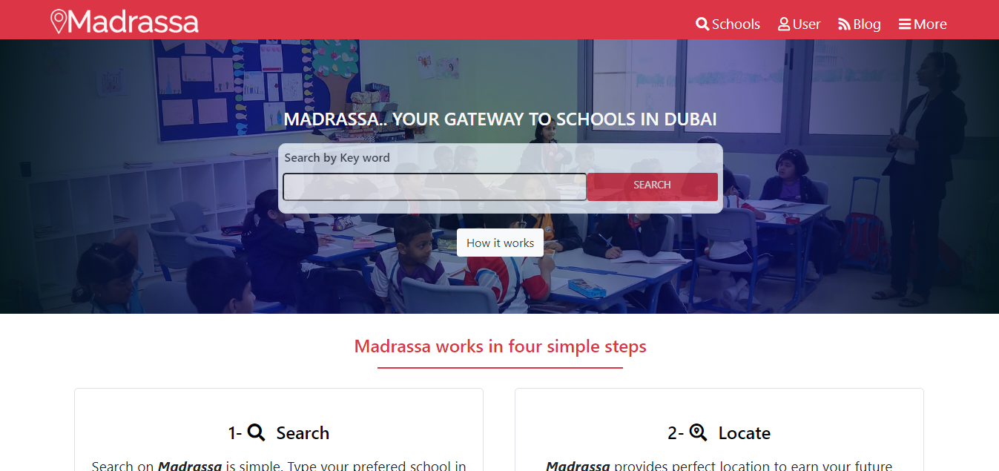

# Dubai_School_Directory
This project is a directory of schools in Dubai

## Built With

- HTML
- CSS
- BOOTSTRAP 4.5

- This project implements core functionalities in CSS3 such as:

1. Flexbox
2. Bootstrap Grid
3. Positioning Using Float, relative, fixed, z-index, and absolute
4. HTML Semantics
5. CSS Gradient
6. Responsiveness
7. UI/UX implementation

- And more

## Live Demo

[Live Demo Link](https://rawcdn.githack.com/happiguru/Dubai_School_Directory/b75620e363aa8abc36199f46fb23176d20811bd1/index.html)

## Getting Started

**Navigation bar**
- This project depicts a directory of kindergarden, secondary and high schools in Dubai.
- You can search through the directory for any school within Dubai

**Project Specification**

- the main page (search page), with a link to the results page
- the search results page, with a list of schools each with a link to the detail school page
- the detail school page

Each of these pages have versions for 3 different screen sizes: 

- mobile: up to 768px
- tablet: up to 1024px
- desktop: from 1024px

To get a local copy  and to set it up and running follow these simple example steps.

### Prerequisites

- Browser
- Internet

- Download the code from repository (https://github.com/happiguru/Dubai_School_Directory/tree/Feature-branch-DSD) and double click the index.html file

## Authors

👤 **Stanley Enow Lekunze**

- Github: [@happiguru](https://github.com/happiguru)
- Twitter: [@Lekunze_Nley](https://twitter.com/Lekunze_Nley)
- Linkedin: [lekunze-nley](https://www.linkedin.com/in/lekunze-nley/)

## Show your support

Give a ⭐️ if you like this project!

## Acknowledgments
-This project gave us a better understanding of the visual properties that must be used on a website.

## 📝 License

This project is [MIT](LICENSE) licensed.
